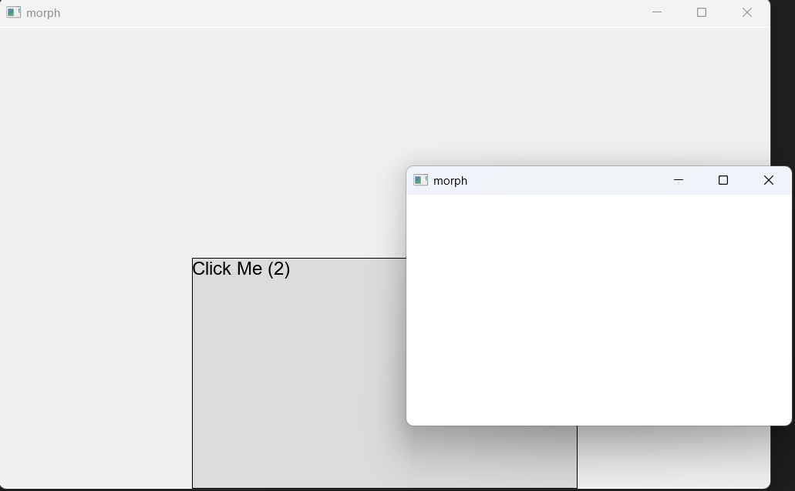

# Morphling - 现代C++ UI框架与JavaScript集成

Morphling是一个创新的C++ UI框架，通过V8引擎将C++的高性能与JavaScript的灵活性完美结合。它允许开发者使用React语法编写前端UI，同时享受C++原生组件的性能优势。

## 核心特性

- **高性能渲染**: 基于SDL3的跨平台硬件加速渲染
- **现代布局**: 使用Facebook Yoga引擎的Flexbox布局系统
- **无缝集成**: V8引擎实现C++与JavaScript的双向绑定
- **React语法**: 支持React组件和Hooks，熟悉的开发体验
- **原生组件**: C++实现的html元素以及自定义原生UI组件

## 项目架构

### 核心模块

```
morphling/
├── main.cpp              # 主入口，V8引擎启动
├── morph/                # 原生C++ UI组件
│   ├── View.h/cpp        # 基础视图类
│   ├── WindowView        # 窗口容器
│   ├── DivView           # 容器视图
│   ├── ButtonView        # 按钮组件
│   ├── TextView          # 文本组件
│   └── YGLayout          # Yoga布局引擎
├── morphling/            # React前端应用
│   ├── app.js            # React主应用
│   ├── morphling.js      # 自定义渲染器
│   ├── webpack.config.js # 构建配置
│   └── dist/             # 打包输出
├── bridge/               # C++/JS桥接层
│   └── v8/               # V8引擎封装
└── 3rdParties/           # 第三方依赖
    ├── v8/               # V8 JavaScript引擎
    ├── sdl/              # SDL3图形库
    ├── yoga/             # Facebook Yoga布局
    └── nlohmann/         # JSON处理
```

### 工作流程

1. **C++启动**: `main.cpp`初始化V8引擎和绑定原生组件
2. **组件绑定**: 通过Needle框架将C++类暴露给JavaScript
3. **JS加载**: 加载webpack打包的React应用
4. **渲染执行**: React通过自定义渲染器创建原生UI组件
5. **事件循环**: SDL3处理用户输入和渲染更新

## 快速开始

### 环境要求

- **CMake**: 3.10+
- **编译器**: 支持C++20的编译器 (MSVC 2019+, GCC 10+, Clang 12+)
- **Node.js**: 14+ (用于前端构建)
- **第三方库**: SDL3, V8, Yoga (已包含在项目中)

### 构建步骤

#### 1. 构建C++应用
```bash
# 创建构建目录
mkdir build && cd build

# 配置CMake
cmake .. -DCMAKE_BUILD_TYPE=Release

# 编译
cmake --build . --config Release
```

#### 2. 构建前端应用
```bash
# 进入前端目录
cd morphling

# 安装依赖
npm install

# 开发模式构建
npm run build:dev

# 生产模式构建
npm run build:prod
```

#### 3. 运行应用
```bash
# 在build目录下运行
./morph  # Linux/macOS
morph.exe  # Windows
```

## 使用示例

### React组件开发（JSX语法）

Morphling支持完整的JSX语法，让你像使用普通React一样编写UI代码。

```javascript
// morphling/app.js
import React from 'react';

function App() {
    const [count, setCount] = React.useState(0);
    
    // 使用 useCallback 来稳定函数引用，避免每次渲染都创建新的函数
    const handleClick = React.useCallback(() => {
        setCount(prevCount => prevCount + 1);
    }, []);
    
    return (
        <window
            style={{
                width: '1000',
                height: '600',
            }}
        >
            <div 
                style={{
                    alignItems: 'center',
                    justifyContent: 'center',
                    flexDirection: 'column',
                }}
            >
                <button
                    key="main-button"
                    onClick={handleClick}
                    style={{
                        widthPercent: "50",
                        heightPercent: "50",
                    }}
                >
                    {`Click Me (${count})`}
                </button>
            </div>
        </window>
    );
}

export { App };
```
### UI呈现



### 支持的组件

- `window` - 窗口容器
- `div` - 容器视图
- `button` - 按钮组件
- `text` - 文本组件

## 开发指南

### 添加新的UI组件

1. **创建C++组件类**:
```cpp
// morph/NewComponent.h
namespace morph {
    class NewComponent : public View {
    public:
        NewComponent();
        virtual void onRender(RendererPtr& renderer, int& offsetX, int& offsetY) override;
    };
}
```

2. **在main.cpp中注册**:
```cpp
needle::Sewable<"NewComponent", nullptr, morph::NewComponent>().accept<V8Bridge>();
```

3. **使用React组件**:
```javascript
// hostEnvironment.js
const HostEnvironment = {
    isValidNode: (node) => {
        return node instanceof View ||
               node instanceof DivView ||
               node instanceof ButtonView ||
               node instanceof WindowView ||
               node instanceof TextView ||
               node instanceof ImageView ||
               node instanceof ScrollView ||
               node instanceof ListView ||
               node instanceof NewComponent;
    },

    createNode: (type) => {
        new Journal().log("createNode");
        switch (type) {
            // ...
            case "NewComponent"
                return new NewComponent();
            default:
                console.warn(`Unknown node type: ${type}, falling back to DivView`);
                return new DivView();
        }
    },

    // ...
}

// 使用组件
```

## 项目路线图

- ✅ 支持JSX语法
- 🔄 支持异步、多线程和多进程
- 🔄 支持更多html元素
- 🔄 完善功能模块
- 🔄 开发者工具集成
- 🔄 自动化测试框架

## 贡献指南

我们欢迎社区贡献！请遵循以下步骤：

1. Fork 项目
2. 创建功能分支 (`git checkout -b feature/AmazingFeature`)
3. 提交更改 (`git commit -m 'Add some AmazingFeature'`)
4. 推送到分支 (`git push origin feature/AmazingFeature`)
5. 创建 Pull Request

### 开发规范
- 遵循现有的代码风格
- 添加适当的注释和文档
- 确保所有测试通过
- 更新相关文档

## 许可证

本项目采用 Apache-2.0 license 许可证 - 查看 [LICENSE](LICENSE) 文件了解详情。